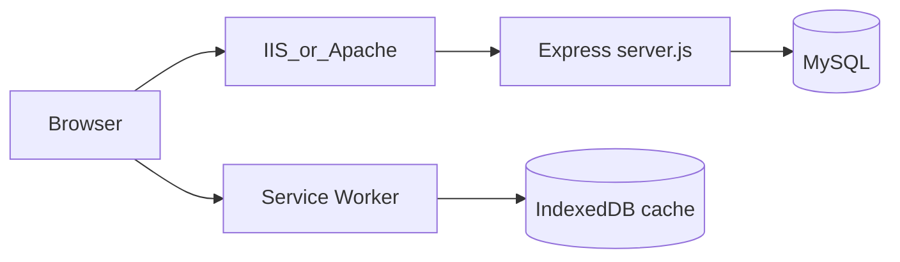

# Compass Directory (Avaya Directory)

Employee phone directory for **Compass Logistics** — search extensions, mobile numbers, station contacts, and manage records through a secure admin panel. Includes a **Progressive Web App (PWA)** for installable, offline-friendly access on phones and desktops.

**Live example:** [directory.compasslog.com](https://directory.compasslog.com)

---

## Features

### Public directory
- Search employees by name, email, department, branch, extension, mobile, and station
- Filter by branch, department, location, and **Works for station** (e.g. backoffice staff supporting Dubai / Dammam / Jeddah / Qatar)
- Browse **directory tree**: country → state → location → station phone numbers
- Optional **passcode gate** or **allowed IP** access before viewing the directory
- **PWA**: install to home screen, offline cache of last-loaded directory, auto-sync when back online

### Admin panel (`/admin`)
- CRUD for employees with multiple extensions per person
- Excel **import / export** (template includes `works_for_station` column)
- Manage countries (branches), states, locations, and station numbers
- Department management with employee counts
- Soft delete with delete-request workflow
- Role-based access: **admin**, **viewer** (read-only), **super_admin**

### Super admin (`/superadmin`)
- Manage admin users
- View audit logs

---

## Tech stack

| Layer | Technology |
|-------|------------|
| Runtime | Node.js 20+ |
| Server | Express 5 |
| Database | MySQL / MariaDB |
| Auth | JWT + SHA-256 password hashes |
| PWA | Service Worker, Web App Manifest, IndexedDB |
| Import/Export | ExcelJS |

---

## Architecture



- **Single Node process** serves static files (HTML, JS, PWA assets) and all `/api/*` routes
- On startup, `bootSchema()` ensures required tables/columns exist (departments, access control, `works_for_station`)
- Behind reverse proxies (IIS, Apache/Passenger, cPanel), `trust proxy` is enabled for correct client IP detection

---

## Project structure

```
avaya-reader/
├── server.js              # Express app, API routes, DB pool, bootSchema
├── app.js                 # Public directory UI + PWA offline/sync logic
├── index.html             # Directory home
├── login.html             # Admin login
├── admin.html             # Employee & location management
├── superadmin.html        # Admin user management
├── manifest.webmanifest   # PWA manifest
├── sw.js                  # Service worker (precache + runtime cache)
├── register-sw.js         # SW registration helper
├── icons/                 # PWA icons (192, 512, maskable, apple-touch)
├── logo.png
├── scripts/
│   ├── build.js           # Production build → dist/
│   ├── init-local-db.js   # Fresh local DB schema + seed super admin
│   ├── start-local.ps1    # Windows local startup helper
│   └── check-db.js        # Compare DB connectivity (dev utility)
├── package.json
└── .env                   # Local config (not committed — see .gitignore)
```

---

## Prerequisites

- **Node.js** 20 or 22 (LTS recommended)
- **MySQL** 8+ or **MariaDB** 10.4+
- npm 9+

---

## Local development

### 1. Clone and install

```bash
git clone https://github.com/sleevetechs/Avaya-directory.git
cd Avaya-directory
npm install
```

### 2. Configure environment

Create a `.env` file in the project root:

```env
PORT=3000
DB_HOST=127.0.0.1
DB_PORT=3306
DB_USER=root
DB_PASSWORD=
DB_NAME=avaya_list
JWT_SECRET=local-dev-secret-change-me
```

| Variable | Description | Default |
|----------|-------------|---------|
| `PORT` | HTTP port Node listens on | `3000` |
| `DB_HOST` | MySQL host | `localhost` |
| `DB_PORT` | MySQL port | `3306` |
| `DB_USER` | MySQL user | `root` |
| `DB_PASSWORD` | MySQL password | *(empty)* |
| `DB_NAME` | Database name | `avaya_list` |
| `JWT_SECRET` | Secret for JWT signing | *(dev fallback in code — set in production)* |
| `DB_SSL` | Set to `1` or `true` for TLS to remote MySQL | off |
| `NODE_ENV` | `production` recommended on servers | unset |

The server loads `.env` automatically on startup (no extra package required).

### 3. Initialize database (fresh install only)

If you do not already have the schema and admin user:

```bash
npm run init-db
```

This creates tables and seeds:

- **Super admin:** `super-admin@compasslog.com` / `1234` *(change immediately after first login)*
- Default department: `Uncategorised`

For an **existing database**, skip this step — `bootSchema()` on server start will apply incremental migrations.

### 4. Start the server

```bash
npm start
```

Or full local bootstrap + start:

```bash
npm run dev
```

On Windows (starts MySQL fallback if needed):

```powershell
powershell -File scripts/start-local.ps1
```

Open [http://localhost:3000](http://localhost:3000)

### 5. Verify

| URL | Expected |
|-----|----------|
| `/api/health` | `{"ok":true,"db":true,...}` |
| `/` | Directory (passcode if access control enabled) |
| `/login` | Admin login page |
| `/manifest.webmanifest` | JSON manifest |

---

## Database

### Core tables

| Table | Purpose |
|-------|---------|
| `employees` | Employee records (name, email, dept, branch, location, `works_for_station`, …) |
| `employee_numbers` | Extensions, mobile, SD numbers per employee |
| `admins` | Admin users and roles |
| `admin_logs` | Audit trail |
| `branches` | Countries / branches |
| `states` | States within a country |
| `locations` | Sites/stations within a state |
| `station_numbers` | Public station phone listings |
| `departments` | Department list |
| `access_allowed_ips` | Office IPs with free directory access |
| `access_passcodes` | Time-limited directory passcodes |
| `access_logs` | Directory access events |

### Auto-migrations (`bootSchema`)

On every server start, the app ensures:

- `departments` table exists and is seeded from employee data
- `employees.works_for_station` column exists
- Access control tables exist

Manual SQL (only if Node cannot start):

```sql
ALTER TABLE employees
ADD COLUMN works_for_station VARCHAR(100) NOT NULL DEFAULT ''
AFTER station_name;
```

---

## User roles

| Role | Access |
|------|--------|
| **super_admin** | Full admin + manage other admins + audit logs. Primary account: `super-admin@compasslog.com` |
| **admin** | Create/edit/delete employees, locations, passcodes, etc. |
| **viewer** | Read-only in admin panel |

Admin passwords are stored as **SHA-256** hashes. Directory passcodes are also SHA-256 hashed.

---

## Directory access control

Until at least one **allowed IP** or **active passcode** exists, the public directory is open.

When enabled:

1. **Allowed office IP** → immediate access
2. **Valid passcode** → JWT cookie/header with configurable duration (seconds / days / months)
3. **Logged-in admin** → bypass passcode for API calls with Bearer token

Configure in **Admin → Access control** (IPs and passcodes).

---

## PWA (Progressive Web App)

### What is cached
- App shell: HTML, `app.js`, logo, icons, manifest, service worker
- Employee list and directory tree in **IndexedDB** after first successful load
- CDN assets (Tailwind, fonts) in runtime cache when visited online

### Offline behavior
- Shows last cached directory with an offline banner
- Does **not** wipe cache on expired passcode during background refresh
- Auto-sync on reconnect, tab focus, and every 60 seconds while online

### Install requirements
- **HTTPS** on a real domain (required for install on Android Chrome)
- `http://localhost` works for local dev; LAN IP over HTTP will **not** show install prompt
- Use the in-app **Install** button or browser menu → **Install app**

---

## NPM scripts

| Command | Description |
|---------|-------------|
| `npm start` | Run `server.js` |
| `npm run dev` | Init DB (if needed) + start server |
| `npm run init-db` | Create schema and seed super admin |
| `npm run build` | Validate project and output production `dist/` folder |

---

## Production build

```bash
npm run build
```

The build script:

1. Validates required files and manifest JSON
2. Syntax-checks JavaScript
3. Copies deployable assets to `dist/`
4. Runs `npm ci --omit=dev` inside `dist/`

Upload **contents of `dist/`** to your server app root. Do **not** upload `.env` — set environment variables on the host.

**Excluded from git/build (use host env instead):** `.env`, `node_modules/`, `debug.log`

---

## Deployment

### Option A — cPanel (CloudLinux + Passenger)

1. Upload full app (or `dist/` contents) to app root, e.g. `/home/USER/avaya_list`
2. **Setup Node.js App:** startup file `server.js`, run **NPM Install**, **Restart**
3. Set environment variables in the Node.js App UI:

   ```
   DB_HOST=localhost
   DB_USER=cpanel_db_user
   DB_PASSWORD=...
   DB_NAME=cpanel_db_name
   JWT_SECRET=long-random-secret
   ```

4. Ensure `.htaccess` / Passenger `PassengerAppRoot` points to the **same folder** as the Node app (not only `public_html` static copies)
5. Test: `https://your-domain.com/api/health` → JSON, not Apache 500

> **Note:** Do not put DB passwords in `.htaccess` — `$` characters break Apache env vars.

### Option B — Azure Windows VM + IIS

Recommended pattern: **IIS reverse proxy → Node Windows Service**

1. Install Node.js, MySQL, IIS, **URL Rewrite**, **ARR** (enable proxy)
2. Deploy app to e.g. `C:\apps\compass-directory`
3. Create `.env` or set env vars on the Windows service
4. Run Node as a service (NSSM or PM2) on `PORT=3000`
5. IIS site URL Rewrite: `(.*)` → `http://localhost:3000/{R:1}`
6. HTTPS via win-acme (Let’s Encrypt) — required for PWA install
7. Open NSG ports **80** and **443** only; keep MySQL **3306** internal

### Option C — Generic Node host

```bash
npm ci --omit=dev
PORT=3000 node server.js
```

Use **pm2**, **systemd**, or your platform’s process manager. Put nginx/Caddy/IIS in front for HTTPS.

---

## API reference

All API routes are under `/api`. Admin routes require `Authorization: Bearer <JWT>` from `/api/login`.

### Health & auth

| Method | Path | Auth | Description |
|--------|------|------|-------------|
| GET | `/api/health` | — | DB connectivity check |
| POST | `/api/login` | — | Admin login → JWT |
| GET | `/api/verify` | Admin | Validate token |

### Employees (public read with access gate)

| Method | Path | Auth | Description |
|--------|------|------|-------------|
| GET | `/api/employees` | Public* | List employees (filters: `search`, `branch`, `dept`, `location_id`, `station_name`, `works_for_station`) |
| GET | `/api/employees/:id` | Admin | Single employee |
| GET | `/api/directory-tree` | Public* | Country/state/location/station tree |
| GET | `/api/filters` | Public* | Filter dropdown data |

### Employees (admin)

| Method | Path | Description |
|--------|------|-------------|
| POST | `/api/employees` | Create employee |
| PUT | `/api/employees/:id` | Update employee |
| DELETE | `/api/employees/:id` | Soft delete |
| POST | `/api/employees/import` | Excel bulk import |
| GET | `/api/employees/import-template` | Download Excel template |

### Locations & org structure

| Resource | Base path |
|----------|-----------|
| Countries / branches | `/api/branches`, `/api/countries` |
| States | `/api/states` |
| Locations | `/api/locations` |
| Station numbers | `/api/stations` |
| Departments | `/api/departments` |

### Access control

| Method | Path | Description |
|--------|------|-------------|
| GET | `/api/access/check` | Current visitor access status |
| POST | `/api/access/unlock` | Submit passcode |
| GET/POST/PUT/DELETE | `/api/access/ips` | Manage allowed IPs |
| GET/POST/PUT/DELETE | `/api/access/passcodes` | Manage passcodes |

### Super admin

| Method | Path | Description |
|--------|------|-------------|
| GET/POST/PUT/DELETE | `/api/admins` | Admin user CRUD |
| GET | `/api/logs` | Audit logs |

\*Public routes subject to passcode/IP access gate unless disabled.

---

## Excel import columns

The import template includes (among others):

| Column | Notes |
|--------|-------|
| `name`, `email`, `dept` | Required fields |
| `branch`, `state_name`, `station_name` | Location hierarchy |
| `works_for_station` | For backoffice staff supporting another site (Dubai, Dammam, etc.) |
| `ext`, `mobile`, `sd`, `sd_no` | Phone fields |

---

## Troubleshooting

| Symptom | Likely cause | Fix |
|---------|--------------|-----|
| `/api/health` returns 500 HTML | Node not running or wrong app root | Fix Passenger/IIS proxy; check `debug.log` |
| `Access denied for user 'root'@'localhost'` | Wrong MySQL credentials | Fix `DB_*` in `.env` or host env |
| Directory shows “Passcode required” | Access control enabled | Enter passcode or add your IP in admin |
| PWA won’t install on phone | HTTP or LAN IP | Use HTTPS on production domain |
| Pages load but API 500 on cPanel | Static files in `public_html` only | Deploy full Node app; align Passenger root |
| `bootSchema` errors in log | DB user lacks ALTER permission | Grant privileges or run manual SQL |

Logs are written to **`debug.log`** in the app directory (not stdout).

---

## Security checklist (production)

- [ ] Set a strong, unique `JWT_SECRET`
- [ ] Change default super-admin password
- [ ] Use HTTPS everywhere
- [ ] Never commit `.env` or database dumps
- [ ] Restrict MySQL to localhost
- [ ] Keep Node.js and dependencies updated
- [ ] Configure directory passcodes / office IPs as needed

---

## License

ISC — see [package.json](./package.json).

---

## Repository

**GitHub:** [github.com/sleevetechs/Avaya-directory](https://github.com/sleevetechs/Avaya-directory)

Maintained by **SleeveTechs** / Compass Logistics IT.
